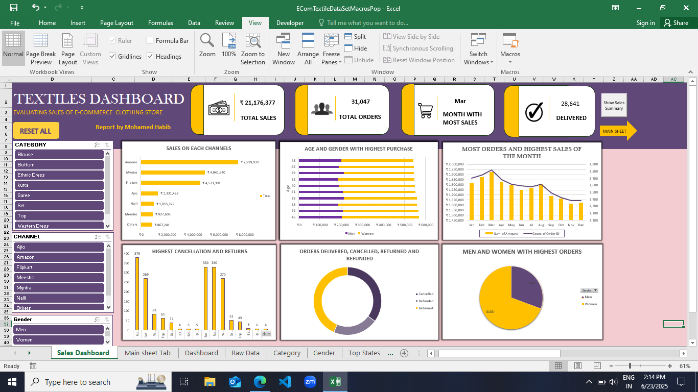

# 🧵 Textile Sales Dashboard – Excel Project

Welcome to my Textile Sales Dashboard project!  
This Excel-based solution provides interactive insights into sales data for the textile industry using pivot tables, slicers, and charts.

---

## 📌 Objective

To create a visually intuitive and interactive dashboard that helps analyze sales patterns, identify top-performing products/regions, and monitor overall business performance.

---

## 📊 Key Features

- 📅 **Monthly & Yearly Sales Trends**
- 🧺 **Product Category Performance**
- 🌍 **Region-wise Sales Breakdown**
- 🔍 **Interactive Slicers** for dynamic filtering
- 🧠 KPIs for quick business insights
- 📈 Clean, user-friendly interface for decision-makers

---

## 🔧 Tools & Techniques Used

- Microsoft Excel
- PivotTables & PivotCharts
- Slicers
- Conditional Formatting
- Data Cleaning & Preprocessing

---

## 📁 Repository Structure
Textile-Sales-Dashboard/
│
├── Textile_Sales_Dashboard.xlsx # Main dashboard file
├── images/
│ └── dashboard_preview.png # Screenshot of the dashboard
└── README.md # Project documentation

---

## 🖼 Dashboard Preview

> A sneak peek into the live dashboard 📷

---

## 👤 About Me

I’m **Habib**, a final-year student and Business Analytics intern at VDart.  
This project is a part of my learning journey in data analytics and visualization using Excel.

🔗 [LinkedIn](https://www.linkedin.com/in/halcyon-habib) | 📬 Feel free to connect!

---

## ⭐ Give it a Star!

If this project helped or inspired you, show some love by starring the repo ⭐

